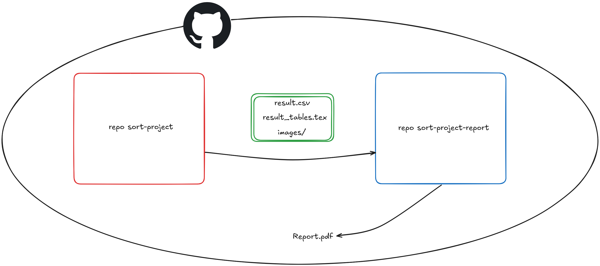

# Sorting Algorithms Report

This repository is part of my pipeline to generate the `Report.pdf` file.

It contains the source code and LaTeX files for a report on various sorting algorithms. The report includes detailed explanations, pseudocode, and experimental results for the following algorithms:

- Selection Sort
- Insertion Sort
- Bubble Sort
- Shaker Sort
- Shell Sort
- Heap Sort
- Merge Sort
- Quick Sort
- Counting Sort
- Radix Sort
- Flash Sort

## Description of the Pipeline to Generate the `Report.pdf` File

The experimental results of this report are entirely conducted through GitHub Actions, using the following two repositories:
- [sort-project](https://github.com/magnusdtd/sort-project/)
- [sort-project-report](https://github.com/magnusdtd/sort-project-report/)

This pipeline includes two main YAML files:

- **YAML file of the sort-project repository**: This file is used to compile, run, and create a new release containing the result files from the C++ project and Jupyter Notebook. The main steps include:
  - Setting up the MSVC environment and compiling the `run.cpp` file into `run.exe`.
  - Running the `run.exe` file to obtain the `result.csv` file.
  - Setting up the Python environment and installing the necessary libraries.
  - Running the Jupyter Notebook to convert the `result.csv` file into a LaTeX table and generate images and charts for the report.
  - Storing the result files such as `result.csv`, `result_tables.tex`, and the `images` directory.
  - Creating a new release on GitHub and uploading the result files.

- **YAML file of the sort-project-report repository**: This file is used to compile and create a new release containing the report file. The main steps include:
  - Downloading the `result.csv`, `result_tables.tex` files, and the `images` directory from the latest release of the sort-project repository.
  - Downloading and extracting the result files.
  - Compiling the LaTeX document into a PDF file.
  - Renaming the PDF file to `Report.pdf`.
  - Creating a new release on GitHub and uploading the `Report.pdf` file.

With this pipeline, conducting experiments multiple times becomes easy without worrying about overloading the computer, while quickly updating the experimental results into the report, saving time.